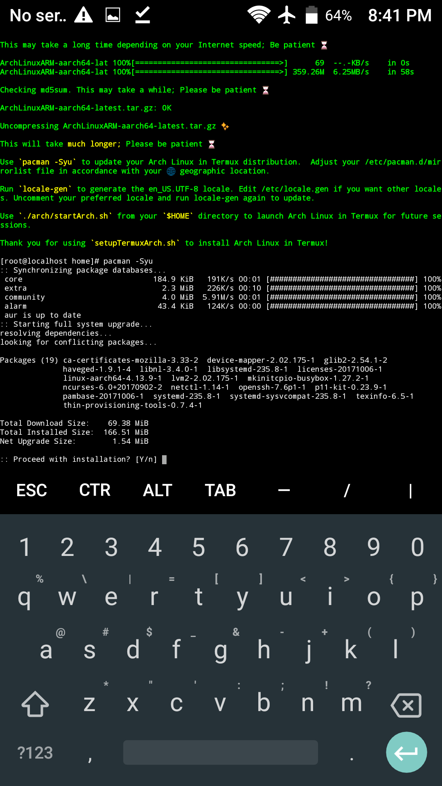

# [TermuxPRoot](https://github.com/sdrausty/TermuxPRoot)

# -rwxrwx--- [setupTermuxPRoot.sh](https://raw.githubusercontent.com/sdrausty/TermuxPRoot/master/setupTermuxPRoot.sh)

This Termux bash setup shell script will attempt to set Linux up in your Termux environment.  When successfully completed, you will be at the bash prompt with Linux in [Termux](https://wiki.termux.com/) on Android and Chrome in the palm of your hand. See [`./docs/install.md`](./install.md) for ways to run this setup script on device.

Use [`setupTermuxPRoot.sh`](https://raw.githubusercontent.com/sdrausty/TermuxPRoot/master/setupTermuxPRoot.sh) to install Linux in Termux on Android and Chrome on your smartphone and tablet.  This setup script will attempt to set Linux up in your Termux environment.  When successfully completed, you will be at the bash prompt with Linux in [Termux](https://wiki.termux.com/) on Android and Chrome in the palm of your hand.

This setup script will attempt to set Linux up in your Termux.  When successfully completed, you will be at a bash prompt in Linux in [Termux](https://wiki.termux.com/) using an Android or Chrome smartphone or tablet. 

* Comments are welcome [here](https://github.com/sdrausty/TermuxPRoot/issues) ✍

* Pull requests are welcome [here](https://github.com/sdrausty/TermuxPRoot/pulls) ✍

Thanks for making this project work; Please contribute 🔆 

Please visit the [Termux wiki website](https://wiki.termux.com/) for more information about Linux on device with Termux.
