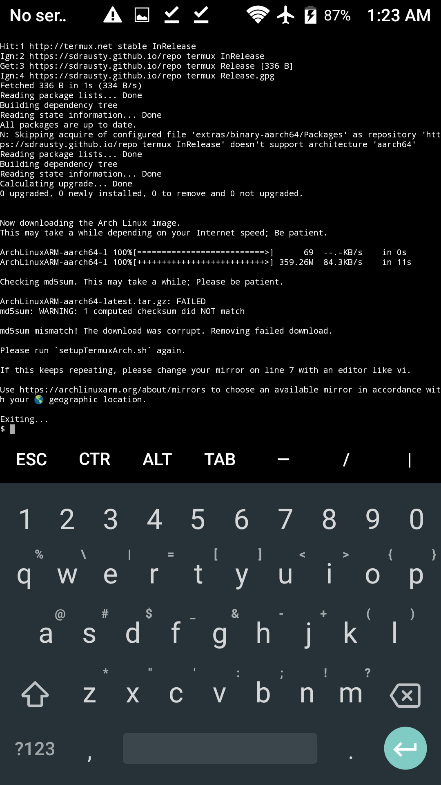

⛔ md5sum mismatch! The download was corrupt. Removing failed download.

Please run `setupTermuxPRoot.sh` again! See https://sdrausty.github.io/TermuxPRoot/md5sums for more information.

If this keeps repeating, please change your mirror on line 7 with an editor like vi.

Use https://archlinuxarm.org/about/mirrors to choose an available mirror in accordance with your geographic location 🌐

See https://sdrausty.github.io/TermuxPRoot/mirrors for more information. Thank you for using `setupTermuxPRoot.sh`.

